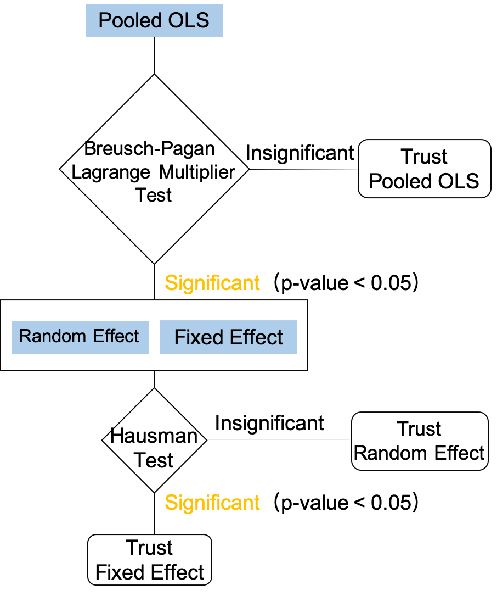

```{r setup, include=FALSE}
knitr::opts_chunk$set(echo = TRUE, warning = F, message = F, cache = T)

library(aod)
library(bestNormalize)
library(data.table)
library(dplyr)
library(kableExtra)
library(knitr)
library(lmtest)
library(GGally)
library(ggplot2)
library(gplots)
library(plm)
library(stargazer)
library(tseries)
```

```{r, echo=F}
data <- read.csv("Data/data_no_missings.csv", header = T)

data$X <- NULL

# Shortening names of the columns
colnames(data) <- c("Country", "Year", "Homicide", "Inequality", "Education_years", "GDP_per_capita",
                    "Lower_secondary_completion_rate", "RnD_expenditure", "School_enrollment", 
                    "Unemployment", "Urbanization_rate","Unsentenced", "Police")

```

# Introduction

The aim of this project is to reproduce and replicate the results of a bachelor thesis study prepared in 2019 by Joanna Ceglinska (one of the authors) and extend the research by using different software, extended dataset, and by implementing more advanced methods of data analysis and visualization.

The topic of the original study was investigating the determinants of crime using panel data of 48 countries for the years 2003-2015. The dependent variable was the homicide rate and independent variables included the Gini index, GDP per capita, unemployment rate, variables responsible for measuring the education level in a country, and a regressor which presents the effectiveness of the judicial system (Unsentenced detainees as a proportion of overall prison population).

---

# An empirical research

## Main implemented modifications

We have decided to not only reproduce the previous research, but also to extend it and to perform the analysis using different software. Previously, the main tools in the study were Microsoft Excel (for the data transformations and filling the missing observations) and STATA for statistical and econometric research. Now, we have used `R` and `Python` for those elements and additionally for data visualization.

We have also implemented a new method of filling in missing data - previous work included manual imputation of all missing values, whereas now we use an automated function that has performed this task. The full description of the algorithm is presented in the subsequent section of the report. 

In our research, we extended the dataset by two years and two variables. The original dataset included the years 2003-2015 and we appended the years 2016 and 2017 to the database. Added variables are the research and development expenditures and the urbanization rate.

Our idea for this analysis is first to prepare a reproduction, and then two replications. The reproduction model is based on those variables and years that were considered in the bachelor thesis. The first replication model (`Replication 1st` section) extends our analysis to include data from the next two years, but maintaining the same set of independent variables as for reproduction. Finally, the second replication model (`Replication 2nd` section) extends the output model not only with data from the next two years, but also with the two new variables mentioned above. In the end, all models are compared with each other and with the model obtained in the bachelor thesis. We also check the robustness of the conclusions resulting from these models.


## The dependent variable

The variable responsible for the representation of crime is the **homicide rate**, which is the number of deaths caused by another person's violence (per 100,000 population). It is worth noting, that homicide is not equivalent to murder - it does not have to result from the intention of causing harm - it can also be a consequence of an accident or reckless acts.

This variable was chosen because is a serious violent crime, that causes significant harm to other people. It is one of the few crimes that is carefully tracked and is not neglected. The investigation associated with this type of crime is usually careful and meticulous. What is more, using a variable associated with a bribe or a financial fraud would be more complicated due to the differences in definitions of those crimes and law regulations among countries.

The distribution of this variable is presented in the plot below. The distribution is highly asymmetrical and right-skewed - the majority of observations are concentrated around zero. Therefore, we have decided to use a logarithmic transformation of the homicide rate in the research, similarly as it was done in the original work. 

```{r, echo=F, fig.align='center', out.width = '80%'}
ggplot(data) +
  geom_histogram(aes(Homicide), fill = "Steelblue", color = "black")
```

The next plot presents how the heterogeneity of the homicide rate has been changing in the years 2003-2017. It can be observed, that the heterogeneity generally tends to decrease.

```{r , echo=F, fig.align='center', out.width='140%'}
plotmeans(Homicide ~ Year, main = "Heterogeineity across years", data = data, text.n.label = "n.")
```


## The dataset description

The variables used in the research are presented in the table below together with their corresponding names used in the analysis. In the last column, we put the source of the data. In particular, in the case of Worldbank, it also contains a code by which you can easily find these variables. The choice of determinants was obviously based on the literature review.

In a nutshell, researchers state that crime is dependent on the efficiency of the jurisdictional system, the income inequality in a country, the education level, unemployment, and the economic condition of a country. In turn, added in this project variables refer to the society's approach to innovation and education, and to urbanization. Based on the literature, it is particularly important to consider the second variable as more crimes tend to happen in cities than in rural areas.

```{r, echo = FALSE, out.width = '80%'}
Variable <- c("Homicide rate (per 100,000 population)",
              "Unsentenced detainees as a proportion of overall prison population",
              "Police personnel (per 100,000 population)",
              "Gini index - income inequality measure",
              "Lower secondary completion rate, total (% of relevant age group)",
              "School enrollment,  tertiary (% gross)",
              "Unemployment, total (% of total labor force) (national estimate)",
              "Compulsory education,  duration (years)",
              "GDP per capita (constant 2010 US$)",
              "Research and development expenditure (% of GDP)",
              "Urban population (% of total population)")

Source <- c("UNODC *", 
            "UNODC *",  
            "UNODC *", 
            "SWIID †",
            "Worldbank (SE.SEC.CMPT.LO.ZS)",
            "Worldbank (SE.TER.ENRR)",
            "Worldbank (SL.UEM.TOTL.NE.ZS)",
            "Worldbank (SE.COM.DURS)",
            "Worldbank (NY.GDP.PCAP.KD)",
            "Worldbank (GB.XPD.RSDV.GD.ZS)",
            "Worldbank (SP.URB.TOTL.IN.ZS)"
            )

Variable_name <- c("Homicide","Unsentenced", "Police", "Inequality", "Lower_secondary_completion_rate",
                   "School_enrollment", "Unemployment", "Education_years", "GDP_per_capita",
                   "RnD_expenditure", "Urbanization_rate")

df_desc <- data.frame(Variable, Variable_name, Source)

df_desc %>%
  kbl(caption = "The variables used in the research and their source") %>%
  kable_material_dark(full_width = T, bootstrap_options = c("hover"), font_size = 12) %>%
  footnote(
    general = c(". * UNODC = United Nations Office on Drugs and Crime",
                ". † SWIID = Standardized World Income Inequality Database"))

```

The original dataset included 48 countries and years 2003-2015. Our extended dataset additionally includes years 2016 and 2017 for all those countries. Adding two years resulted thus in 96 observations more than in the original dataset. The summary of the differences can be found in the table below. 

```{r, echo = FALSE, fig.align='center'}
Original <- c("Years 2003-2015",
              "8 independent variables",
              "624 observations in total")

Extended <- c("Years 2003-2017", 
              "2 additional variables (10 in total): 
                <br> - Research and development expenditure 
                <br> - Urbanization rate",
              "720 observations in total")

df_differences <- data.frame(Original, Extended)

df_differences %>%
  kable("html", escape = FALSE, caption = "The summary of the differences between the datasets") %>%
  kable_styling(full_width = F) 
```

## Filling the missing values

First of all, it is worth mentioning that filling the missing values in the database for the bachelor thesis was done manually, without any specific knowledge. The author mainly relied on visual trends, which made the results vulnerable to significant errors in later estimates.

In our project, we decided to implement our own function based on a moving average algorithm with two-period window that fills in the blanks automatically based on existing values. Thanks to this, the results should be more consistent and the estimators less biased. What is more, this fast and reusable algorithm can be easily used in possible later replications.

The definition of this function can be viewed below.

<details><summary>Show the definition of the function <font color="red">(Click to show)</font></summary>

```{python, eval=F}
import pandas as pd

def interpolate_ma(df, window):
    for column in df:
        nans = list(df[column].isna())
        values = list(df[column])
        if sum(nans) != 0:
            for i, val in enumerate(nans):
                if i == 0 and val:
                    values[i] = values[min([i for i, x in enumerate(nans) if not x])]
                elif i > 0 and i < window and val:
                    values[i] = np.mean(values[0:i])
                elif i >= window and val:
                    values[i] = np.mean(values[i-window:i])

        df[column] = values
                
    return df
```
</details>
<br/>


---

## Research hypotheses

The literature review prompts us to formulate hypotheses as to the influence of selected variables on the dependent variable, which will be verified in an empirical study. The hypotheses posed in the bachelor's thesis on which we base the project are as follows:

* Income inequality has a negative effect on the homicide rate.
* GDP per capita has a negative effect on the homicide rate.
* The level of education in a country influences crime (the higher the level, the lower the crime).
* The ease of detecting a crime acts as a deterrent to the decision to commit a crime.
* Poor labor market conditions in the country have a positive effect on the homicide rate.
* The effectiveness of the justice system has a positive effect on the homicide rate.

At the end of our analysis, we will check whether our reproduction and replication models confirm these hypotheses. Next, we will compare it with the results of the model obtained in the bachelor thesis.


# Reproduction

Let us now move to the reproduction modeling part of our project. Based on the same data as in the bachelor thesis (the one before dealing with the missing values), we check whether we get the same results. However, this time we use for this analysis different software, and therefore slightly different functions. In addition, as already mentioned before, we use a more accurate method of filling in the missing data.

We first decided to briefly present how in general we deal with choosing the appropriate type of model in the case of panel data.

#### The general schema of the type of model selection in the panel data

<div style= "float:right">
[source](https://l.facebook.com/l.php?u=https%3A%2F%2Frpubs.com%2FRitaTang%2Fplm%3Ffbclid%3DIwAR3osT_Yh_Xk54XA3u7sgbYoyjrglOP6yIwI6LDaYyBZOFfcXm5qj97nrKI&h=AT1jYC5erhkfPTeDDYzaXwPP13bFZ6mFpeLUayUzD9hsQfZg-vcc7s7rGMEc-6vCEO4Cs8BXwC4RzR5uODQmzX70Z8hBMDa3ndRapPOW-PX62bpJ0VJlVgO33wqw4tlA3ltn)
</div>

```{r , echo=FALSE, out.width = '55%', fig.align='center'}

```

At the beginning, we check whether the random and fixed effects are significant based on Breusch-Pagan Lagrange Multiplier Test. If they both are not, we simply use Pooled Ordinary Least Squares (POLS) model. However, if those effects are significant, we then check using Huasmann test which model it is better to use: fixed effects model or random effects model.

In our analysis, we also decided to check additionally whether time effects are needed in the model (again using the appropriate Breusch-Pagan Lagrange Multiplier Test). Also in general, the significance level naturally can be chosen different than 5% as on the graph. Setting this level will be possible, among others, in the functions that are an automated part of our analysis.

## Data transformation

Having filled in the missing values in the data, for reproduction purposes, we limit the data to the variables that were considered in the bachelor's thesis (i.e. without *RnD_expenditure* and *Urbanization_rate*) for the years up to 2015.

```{r}
df <- data %>%
  select(Country, Year, Homicide, Inequality, Education_years, GDP_per_capita,
         Lower_secondary_completion_rate, School_enrollment, Unemployment, Unsentenced, Police) %>%
  filter(Year %in% 2003:2015)
```

Let us perform some data transformation now.

### Homicide

As already shown before, *Homicide* variable seems to be right-skewed. Therefore we should consider its log-transformation. Since there is  `r sum(df$Homicide <= 0)` observations for which *Homicide* is non-positive, we do not need to add any number to it inside the logarithm function.

### {.tabset .tabset-fade .tabset-pills}

#### Basic form

```{r, echo=F, fig.align='center', out.width = '80%'}
ggplot(df) +
  geom_histogram(aes(Homicide), fill = "Steelblue", color = "black")
```

#### Log-transformed

```{r, echo=F, fig.align='center', out.width = '80%'}
ggplot(df) +
  geom_histogram(aes(log(Homicide)), fill = "Steelblue", color = "black")
```

### {-}

Having applied Box-Cox transformation for this variable, we got the result that the optimal $\lambda$ = `r bestNormalize::boxcox(df$Homicide)$lambda %>% round(4)`.

It is not that close to zero, but since after this transformation the distribution is more symmetric and since it was performed in the original analysis, we decided to log-transform it.

Therefore, we create the logarithm of the dependent variable:

```{r}
df$ln_Homicide <- log(df$Homicide)
```

### GDP per capita

Now we can consider *GDP_per_capita* variable, which based on the plots below, seems to have much right-skewed distribution.

### {.tabset .tabset-fade .tabset-pills}

#### Basic form

```{r, echo=F, fig.align='center', out.width = '80%'}
ggplot(df) +
  geom_histogram(aes(GDP_per_capita), fill = "Steelblue", color = "black")
```

#### Log-transformed

```{r, echo=F, fig.align='center', out.width = '80%'}
ggplot(df) +
  geom_histogram(aes(log(GDP_per_capita)), fill = "Steelblue", color = "black")
```

### {-}

Box-Cox transformation for this variable indicates that the optimal $\lambda$ = `r bestNormalize::boxcox(df$GDP_per_capita)$lambda %>% round(4)`, which confirms that it is better to use the logarithm of this variable in the model. The same transformation was made in the original analysis.

```{r}
df$ln_GDP_per_capita <- log(df$GDP_per_capita)
```

### Unemployment

In the case of *Unemployment* variable, we decided to transform it exactly in the same way it was done in the bachelor thesis, i.e. to divide its values into 3 groups referred to as `low`, `medium`, and `high` rate of unemployment.

```{r}
df$Unemployment_int <- cut(df$Unemployment,
                           breaks = c(0,5.5,8.5,Inf),
                           labels = c("_low", "_medium","_high"))
```

## Panel data models

In this part we finally estimate three kinds of model for the panel data, that is fixed effects model, random effects model and POLS model. To do this, we use `plm()` function from the package of the same name. 

In order to obtain the appropriate models, we need to choose the corresponding value of the `model` argument as follows:

```{r}
# fixed effects model
fixed <- plm(ln_Homicide ~ Inequality + Education_years + ln_GDP_per_capita +
             Lower_secondary_completion_rate + School_enrollment + Unemployment_int + Unsentenced + Police,
             data = df, 
             index = c("Country", "Year"),
             model = "within")
```

```{r}
# random effects model
random <- plm(ln_Homicide ~ Inequality + Education_years + ln_GDP_per_capita +
               Lower_secondary_completion_rate + School_enrollment + Unemployment_int + Unsentenced + Police,
             data = df, 
             index = c("Country", "Year"),
             model = "random")
```

```{r}
# POLS
pols <- plm(ln_Homicide ~ Inequality + Education_years + ln_GDP_per_capita +
              Lower_secondary_completion_rate + School_enrollment + Unemployment_int + Unsentenced + Police,
            data = df,
            index = c("Country", "Year"),
            model = "pooling")
```

## Model selection

In order to make a faster, almost automatic decision on which type of model should be used, we have created a `model_select()` function. It returns the table with the results of the statistical tests that are necessary in the model choice. Those tests were already mentioned, but they are also mentioned in the definition of this function, which can be viewed below.

This function takes 4 arguments: fixed effects model object, random effects model object, POLS model object, and significance level (`sig.level`) with the default value set to 5%.

```{r}
source("functions/model_select.R")
```

<details><summary>Show the definition of the function <font color="red">(Click to show)</font></summary>

```{r}
model_select <- function(fixed, random, pols, sig.level = 0.05) {
  
  library(dplyr)
  library(plm)
  
  
  # Breusch-Pagan Lagrange Multiplier test for random effects
  random_effects <- plmtest(pols, type=c("bp"))
  
  random_effects_con <- ifelse(random_effects$p.value < sig.level,
                               "significant random effects",
                               "insignificant random effects")
  
  # F test for individual fixed effects
  fixed_effects <- pFtest(fixed, pols)
  
  fixed_effects_con <- ifelse(fixed_effects$p.value < sig.level,
                              "significant fixed effects",
                              "insignificant fixed effects")
  
  # Breusch-Pagan Lagrange Multiplier test for time-fixed effects
  time_fixed_effects <- plmtest(fixed, c("time"), type=("bp"))
  
  time_fixed_effects_con <- ifelse(time_fixed_effects$p.value < sig.level,
                                   "time-fixed effects needed",
                                   "no time-fixed effects needed")
  
  # Hausmann test
  hausmann <- phtest(fixed, random)
  
  hausmann_con <- ifelse(hausmann$p.value < sig.level,
                         "choose fixed effects model",
                         "choose random effects model")
  
  
  # Data frame result
  result <- data.frame(
    test = c("Breusch-Pagan LM test for random effects",
             "F test for individual fixed effects",
             "Breusch-Pagan LM test for time-fixed effects",
             "Hausmann test"
             ),
    p.value = c(random_effects$p.value, fixed_effects$p.value, 
              time_fixed_effects$p.value, hausmann$p.value) %>% 
      round(4),
    conclusion = c(random_effects_con, fixed_effects_con,
                 time_fixed_effects_con, hausmann_con) ,
    row.names = NULL
    )
  
  result$p.value <- ifelse(result$p.value == 0, "< 0.0001" , result$p.value)
  
  
  return(result)

}
```
</details>
<br/>

By applying the created function to 3 defined earlier models, we get the following table as a result.

```{r, echo=F}
model_select(fixed, random, pols) %>% 
  kbl(booktabs = T, caption = "Reproduction - model select") %>%
  kable_material_dark(full_width = F, bootstrap_options = c("hover"), font_size = 14)
```

In this case, based on internally performed statistical tests, we can conclude that effects are significant in both random and fixed effects models. In addition, there is no need for time effects. Therefore, we check the Hausmann test, which indicates that it is better to use fixed effects model in this case.

## General-to-specific procedure {.tabset .tabset-fade .tabset-pills}

Due to the results obtained above, we are focusing on the fixed effects model. Since it contains insignificant variables, we perform a *from-general-to-specific* procedure to get rid of them from the model.

Although we could have automated this part as well, we found it an inappropriate approach as deleting sequentially variables is rather case-specific and one should have a broader perspective than just an automated approach concentrated mainly on *p-values*. Therefore, we present below the steps of eliminating insignificant variables.

### Base model

Let us take a look at the base model, which we called `fixed`.

<center>
```{r, echo=F, results = 'asis'}
stargazer(fixed, type = "html", single.row = T, report = "vcs*")
```
</center>

### Step 1

**Deleting *Lower_secondary_completion_rate* **

First, we generate the model without *Lower_secondary_completion_rate*.

```{r}
model1.1 <- plm(ln_Homicide ~ Inequality + Education_years + ln_GDP_per_capita +
                School_enrollment + Unemployment_int + Unsentenced + Police,
                data = df,
                index=c("Country", "Year"),
                model="within")
```

Next, we check the significance of omitting this variable using the Wald test. Namely, we test whether the coefficient of the *Lower_secondary_completion_rate* variable is equal to zero.

```{r, echo=F}
h <- rbind(c(0,0,0,1,0,0,0,0,0))

wald.test(b = coef(fixed), Sigma = vcov(fixed), L = h)
```

We fail to reject the null hypothesis regarding the introduced constraint. Therefore, we can drop *Lower_secondary_completion_rate*. The model without this variable is as follows:

<center>
```{r, echo=F, results = 'asis'}
stargazer(model1.1, type = "html", single.row = T, report = "vcs*p")
```
</center>


### Step 2

**Deleting *Police* **

First, we generate the model without *Police* and without *Lower_secondary_completion_rate*.

```{r}
model1.2 <- plm(ln_Homicide ~ Inequality + Education_years + ln_GDP_per_capita +
                School_enrollment + Unemployment_int + Unsentenced,
                data = df,
                index=c("Country", "Year"),
                model="within")
```

Next, we check the significance of omitting these variables using the Wald test. Namely, we test whether the coefficients of *Police* and *Lower_secondary_completion_rate* are both equal to zero.

```{r, echo=F}
h <- rbind(c(0,0,0,1,0,0,0,0,0),c(0,0,0,0,0,0,0,0,1)) 

wald.test(b = coef(fixed), Sigma = vcov(fixed), L = h)
```

We fail to reject the null hypothesis regarding the introduced constraints. Therefore, we can also drop *Police*. The model without these variables is as following:

<center>
```{r, echo=F, results = 'asis'}
stargazer(model1.2, type = "html", single.row = T, report = "vcs*p")
```
</center>


### Step 3

**Deleting *Inequality* **

First, we generate the model without *Inequality*, *Police* and *Lower_secondary_completion_rate*.

```{r}
model1.3 <- plm(ln_Homicide ~ Education_years + ln_GDP_per_capita +
                School_enrollment + Unemployment_int + Unsentenced,
                data = df,
                index=c("Country", "Year"),
                model="within")
```

Next, we check the significance of omitting these variables using the Wald test. Namely, we test whether the coefficients of *Inequality*, *Police* and *Lower_secondary_completion_rate* are all equal to zero.

```{r, echo=F}
h <- rbind(c(0,0,0,1,0,0,0,0,0),c(0,0,0,0,0,0,0,0,1),c(1,0,0,0,0,0,0,0,0))

wald.test(b = coef(fixed), Sigma = vcov(fixed), L = h)
```

We fail to reject the null hypothesis regarding the introduced constraints. Therefore, we can also drop *Inequality*, which contradicts literature. The model without these variables is as follows:

<center>
```{r, echo=F, results = 'asis'}
stargazer(model1.3, type = "html", single.row = T, report = "vcs*p")
```
</center>

### Final model

All the remaining variables are significant and jointly significant, so our final model is as follows:

<center>
```{r, echo=F, results = 'asis'}
stargazer(model1.3, type = "html", single.row = T, report = "vcs*")
```
</center>

---

## Model diagnostic

Dropping insignificant variables does not end the modeling. Now we need to move on to the model diagnostic. For this, we again used some automatization approach based on our own function - `model_diagnostic()`. It returns the table with the results and conclusions of the statistical tests that are crucial in the model diagnostic, including tests for: normality of residuals, cross-sectional dependence, serial correlation and heteroskedasticity. Details one can see in the function definition below.

`model_diagnostic()` function takes 2 arguments: model object of the `plm` class and significance level (`sig.level`) with default value set to 5%.

```{r}
source("functions/model_diagnostic.R")
```

<details><summary>Show the definition of the function <font color="red">(Click to show)</font></summary>

```{r}
model_diagnostic <- function(model, sig.level = 0.05) {
  
  library(dplyr)
  library(lmtest)
  library(plm)
  library(tseries)
  
  
  # Jarque-Bera LM test for normality of residuals
  jarque_bera <- jarque.bera.test(model$residuals)
  
  jarque_bera_con <- ifelse(jarque_bera$p.value < sig.level,
                            "not normally distributed residuals", "normally distributed residuals")
  
  # Breusch-Pagan LM test for cross-sectional dependence
  cross_sectional_BP <- pcdtest(model, test = c("lm"))
  
  cross_sectional_BP_con <- ifelse(cross_sectional_BP$p.value < sig.level,
                                   "cross-sectional dependence", "no cross-sectional dependence")
  
  # Pesaran CD test for cross-sectional dependence
  cross_sectional_P <- pcdtest(model, test = c("cd"))
  
  cross_sectional_P_con <- ifelse(cross_sectional_P$p.value < sig.level,
                                  "cross-sectional dependence", "no cross-sectional dependence")
  
  # Breusch-Godfrey/Wooldridge test for serial correlation
  serial_correlation <- pbgtest(model)
  
  serial_correlation_con <- ifelse(serial_correlation$p.value < sig.level,
                                   "serial correlation", "no serial correlation")
  
  # Breusch-Pagan test for heteroskedasticity
  heteroskedasticity <- bptest(model$formula,
                               data = model$model,
                               studentize=F)
  
  heteroskedasticity_con <- ifelse(heteroskedasticity$p.value < sig.level,
                                   "heteroskedasticity", "homoskedasticity")
  
  
  # Data frame result
  result <- data.frame(
    test = c("Jarque-Bera LM test for normality of residuals",
             "Breusch-Pagan LM test for cross-sectional dependence",
             "Pesaran CD test for cross-sectional dependence",
             "Breusch-Godfrey/Wooldridge test for serial correlation",
             "Breusch-Pagan test for heteroskedasticity"
    ),
    p.value = c(jarque_bera$p.value, cross_sectional_BP$p.value, cross_sectional_P$p.value, 
                serial_correlation$p.value, heteroskedasticity$p.value) %>% 
      round(4),
    conclusion = c(jarque_bera_con, cross_sectional_BP_con, cross_sectional_P_con,
                   serial_correlation_con, heteroskedasticity_con),
    row.names = NULL
  )
  
  result$p.value <- ifelse(result$p.value == 0, "< 0.0001" , result$p.value)
  
  
  return(result)
  
}
```
</details>
<br/>

For our final fixed effects model we have the following results:

```{r, echo=F}
model_diagnostic(model1.3) %>% 
  kbl(booktabs = T, caption = "Reproduction - model diagnostic") %>%
  kable_material_dark(full_width = F, bootstrap_options = c("hover"), font_size = 14)
```

This means that residuals of our model are not normally distributed, and at the same time, we have to deal with all the problems: cross-sectional dependence, serial correlation and heteroskedasticity.

Let us start with the issue of the distribution of the residuals. We plot it below, together with the normal distribution with the parameters based on residuals values.

```{r, echo=F, fig.align='center', out.width = '80%'}
hist(model1.3$residuals,
     density = 20, breaks = 20, prob = T, xlim = c(-1,1), 
     xlab="Residuals",
     main="Reproduction model - histogram of the residuals")
curve(dnorm(x,
            mean = mean(model1.3$residuals),
            sd = sqrt(var(model1.3$residuals))), 
      col="steelblue", lwd = 2, add = T, yaxt = "n")
```

The graph shows that the distribution of residuals is rather close to the normal distribution. So where does this discrepancy come from?

Note that the Jarque-Bera test often rejects the null hypothesis for large samples (like here) where it detects even a small deviation in the distribution of the residuals from the normal distribution. Moreover, the lack of normality in the distribution of residuals is not very significant for large samples.

What about the other three problems? We need to use the appropriate robust estimator.

### Robust estimator

The robust estimator we are using below (`vcovHC()` function with the `method` argument set to `arellano`) is appropriate for both heteroskedasticity and serial correlation problems. Additionally, it is also highly recommended in the case of the fixed effects models.

How about the cross-sectional dependence?

In general, since we have less than 20 years of observations it is sometimes said that there is no need to deal with the cross-sectional dependence. Nevertheless, we decided to include also this issue in our robust estimator. Namely, by setting `cluster = "time"` inside `vcovHC()` function, observations are clustered by "time" to account for the cross-sectional correlation.

```{r, eval=F}
coeftest(model1.3,
         vcovHC(model1.3, method = "arellano", type="HC0", cluster = "time"))
```

The obtained results are displayed in the next section. Worth mentioning is that those results obviously do not differ among the values of estimators, but only among their significance levels. In our case, all of the chosen variables were still significant.

---

## BA model

For the sake of comparison, we next estimated the model that has been recognized as the best in the BA thesis to which we are referring. For this purpose, we took exactly the same independent variables that were present and significant in that BA model. Next, we estimated it as below.

```{r}
model_BA <- plm(ln_Homicide ~ Inequality + ln_GDP_per_capita + School_enrollment + Police + Unsentenced,
                data = df, 
                index=c("Country", "Year"),
                model="within")
```

<center>
```{r, echo=F, results = 'asis'}
stargazer(model_BA, type = "html", single.row = T, report = "vcs*p")
```
</center>

Note that slightly different variables were selected for the final model in the BA thesis. What is more, not all those variables were proven to be significant in the model constructed in this way.

Similarly as earlier, we then check the diagnostic of this model using our `model_diagnostic()` function.

```{r, echo=F}
model_diagnostic(model_BA) %>% 
  kbl(booktabs = T, caption = "Bachelor - model diagnostic") %>%
  kable_material_dark(full_width = F, bootstrap_options = c("hover"), font_size = 14)
```

We encountered the same problems inside the diagnostic of the BA model as earlier. Interestingly, the results of these tests, apart from the Jarque-Bere test result, coincide with the results of the BA thesis.

The graph below indicates that again we should not worry about the Jarque-Bera test result. For the other three issues, we used the appropriate estimator as earlier.

```{r, echo=F, fig.align='center', out.width = '80%'}
hist(model_BA$residuals,
     density = 20, breaks = 20, prob = T, xlim = c(-1,1), 
     xlab="Residuals",
     main="Bachelor model - histogram of the residuals")
curve(dnorm(x,
            mean = mean(model_BA$residuals),
            sd = sqrt(var(model_BA$residuals))), 
      col="steelblue", lwd = 2, add = T, yaxt = "n")
```

Finally, we could compare the results from the bachelor thesis with our reproduction model. Results presented below were obtained after introducing robust estimators to those models.

<center>
```{r, echo=F, results = 'asis'}
model1.final <- coeftest(model1.3, vcovHC(model1.3, method = "arellano", type="HC0", cluster = "time"))

model_BA.final <- coeftest(model_BA, vcovHC(model_BA, method = "arellano", type="HC0", cluster = "time"))

stargazer(model_BA.final, model1.final,
          type = "html",
          column.labels = c("Bachelor","Reproduction"),
          title = "BA model vs. reproduction model")

```
</center>

As we can see, our reproduction model differs from the one from the bachelor thesis. First of all, we have different variables taken into account as significant ones. Secondly, the two variables in the BA model are not significant. On the other hand, we may observe some similarities in the parameters values and their signs (see *Unsentenced* or *School_enrollment* variables).

# Replication 1st 

In this part, we perform the first of two replication analyses of our project. The assumptions about the software used and the way of filling in the missing values remain the same as in the case of the reproduction part. This time, however, we estimate the model, but including the next 2 years of observations for each country, which gives us jointly 96 new observations added to the dataset. 

The main goal of this replication is naturally to check the robustness of the results when considering the extended database.

## Data transformation

In the first replication part, as described above we limit the data to the variables that were considered in the bachelor's thesis (i.e. without *RnD_expenditure* and *Urbanization_rate*), but this time for all the years in the database (including 2016 and 2017).

```{r}
df2 <- data %>%
  select(Country, Year, Homicide, Inequality, Education_years, GDP_per_capita,
         Lower_secondary_completion_rate, School_enrollment, Unemployment, Unsentenced, Police)
```

In the next step, we perform data transformations again. Formally, including two new years could somehow change the distribution of variables. Therefore, it is better to look at these variables again.

### Homicide

*Homicide* variable still seems to be right-skewed.

### {.tabset .tabset-fade .tabset-pills}

#### Basic form

```{r, echo=F, fig.align='center', out.width = '80%'}
ggplot(df2) +
  geom_histogram(aes(Homicide), fill = "Steelblue", color = "black")
```

#### Log-transformed

```{r, echo=F, fig.align='center', out.width = '80%'}
ggplot(df2) +
  geom_histogram(aes(log(Homicide)), fill = "Steelblue", color = "black")
```

### {-}

Having applied Box-Cox transformation for this variable, we got the result that the optimal $\lambda$ = `r bestNormalize::boxcox(df2$Homicide)$lambda %>% round(4)`, which is almost the same as before.

Generally, the results are similar as before, thus using the same argumentation, we create the logarithm of the dependent variable:

```{r}
df2$ln_Homicide <- log(df2$Homicide)
```

### GDP per capita

*GDP_per_capita* variable invariably seems to have much right-skewed distribution.

### {.tabset .tabset-fade .tabset-pills}

#### Basic form

```{r, echo=F, fig.align='center', out.width = '80%'}
ggplot(df2) +
  geom_histogram(aes(GDP_per_capita), fill = "Steelblue", color = "black")
```

#### Log-transformed

```{r, echo=F, fig.align='center', out.width = '80%'}
ggplot(df2) +
  geom_histogram(aes(log(GDP_per_capita)), fill = "Steelblue", color = "black")
```

### {-}

Box-Cox transformation for this variable indicates that the optimal $\lambda$ = `r bestNormalize::boxcox(df2$GDP_per_capita)$lambda %>% round(4)`, which confirms that it is still better to use the logarithm of this variable in the model.

```{r}
df2$ln_GDP_per_capita <- log(df2$GDP_per_capita)
```

### Unemployment

*Unemployment* variable is transformed in the exactly same way it was done in the bachelor thesis and in the reproduction part.

```{r}
df2$Unemployment_int <- cut(df2$Unemployment,
                            breaks = c(0,5.5,8.5,Inf),
                            labels = c("_low", "_medium","_high"))
```

## Model selection

Similarly as before, in this part, we estimate fixed effects model, random effects model and POLS model, but this time with the usage of the new, extended dataset.

```{r}
# fixed effects model
fixed2 <- plm(ln_Homicide ~ Inequality + Education_years + ln_GDP_per_capita +
               Lower_secondary_completion_rate + School_enrollment + Unemployment_int + Unsentenced + Police,
              data = df2,
              index = c("Country", "Year"),
              model = "within")
```

```{r}
# random effects model
random2 <- plm(ln_Homicide ~ Inequality + Education_years + ln_GDP_per_capita +
                Lower_secondary_completion_rate + School_enrollment + Unemployment_int + Unsentenced + Police,
               data = df2,
               index = c("Country", "Year"),
               model = "random")
```

```{r}
# POLS
pols2 <- plm(ln_Homicide ~ Inequality + Education_years + ln_GDP_per_capita +
              Lower_secondary_completion_rate + School_enrollment + Unemployment_int + Unsentenced + Police,
             data = df2,
             index = c("Country", "Year"),
             model = "pooling")
```

In order to check which of these models should be used in this replication part, we use our earlier defined `model_select()` function. The results are below:

```{r, echo=F}
model_select(fixed2, random2, pols2) %>%
  kbl(booktabs = T, caption = "Replication 1st - model select") %>%
  kable_material_dark(full_width = F, bootstrap_options = c("hover"), font_size = 14)
```

In this case, based on internally performed statistical tests, we can conclude that effects are significant in both random and fixed effects models. In addition, there is no need for time effects. Therefore, we check the Hausmann test, which indicates that it is better to use fixed effects model in this case.

This means that so far we have obtained the same results as in the reproduction part.


## General-to-specific procedure {.tabset .tabset-fade .tabset-pills}

Due to the results obtained above, we are focusing on the fixed effects model. Since it contains insignificant variables, we perform a *from-general-to-specific* procedure to get rid of them from the model.

### Base model

Let us take a look at the base model.

<center>
```{r, echo=F, results = 'asis'}
stargazer(fixed2, type = "html", single.row = T, report = "vcs*")
```
</center>

### Step 1

**Deleting *Lower_secondary_completion_rate* **

First, we generate the model without *Lower_secondary_completion_rate*.

```{r}
model2.1 <- plm(ln_Homicide ~ Inequality + Education_years + ln_GDP_per_capita +
                School_enrollment + Unemployment_int + Unsentenced + Police,
                data = df2,
                index=c("Country", "Year"),
                model="within")
```

Next, we check the significance of omitting this variable using the Wald test. Namely, we test whether the coefficient of the *Lower_secondary_completion_rate* variable is equal to zero.

```{r, echo=F}
h <- rbind(c(0,0,0,1,0,0,0,0,0))

wald.test(b = coef(fixed2), Sigma = vcov(fixed2), L = h)
```

We fail to reject the null hypothesis regarding the introduced constraint. Therefore, we can drop *Lower_secondary_completion_rate*. The model without this variable is as follows:

<center>
```{r, echo=F, results = 'asis'}
stargazer(model2.1, type = "html", single.row = T, report = "vcs*p")
```
</center>


### Step 2

**Deleting *Police* **

First, we generate the model without *Police* and without *Lower_secondary_completion_rate*.

```{r}
model2.2 <- plm(ln_Homicide ~ Inequality + Education_years + ln_GDP_per_capita +
                School_enrollment + Unemployment_int + Unsentenced,
                data = df2,
                index=c("Country", "Year"),
                model="within")
```

Next, we check the significance of omitting these variables using the Wald test. Namely, we test whether the coefficients of *Police* and *Lower_secondary_completion_rate* are both equal to zero.

```{r, echo=F}
h <- rbind(c(0,0,0,1,0,0,0,0,0),c(0,0,0,0,0,0,0,0,1))

wald.test(b = coef(fixed2), Sigma = vcov(fixed2), L = h)
```

We fail to reject the null hypothesis regarding the introduced constraints. Therefore, we can also drop *Police*. The model without these variables is as following:

<center>
```{r, echo=F, results = 'asis'}
stargazer(model2.2, type = "html", single.row = T, report = "vcs*p")
```
</center>


### Step 3

**Deleting *Inequality* **

First, we generate the model without *Inequality*, *Police* and *Lower_secondary_completion_rate*.

```{r}
model2.3 <- plm(ln_Homicide ~ Education_years + ln_GDP_per_capita +
                School_enrollment + Unemployment_int + Unsentenced,
                data = df2,
                index=c("Country", "Year"),
                model="within")
```

Next, we check the significance of omitting these variables using the Wald test. Namely, we test whether the coefficients of *Inequality*, *Police* and *Lower_secondary_completion_rate* are all equal to zero.

```{r, echo=F}
h <- rbind(c(0,0,0,1,0,0,0,0,0),c(0,0,0,0,0,0,0,0,1),c(1,0,0,0,0,0,0,0,0))

wald.test(b = coef(fixed2), Sigma = vcov(fixed2), L = h)
```

We fail to reject the null hypothesis regarding the introduced constraints. Therefore, we can also drop *Inequality*. The model without these variables is as follows:

<center>
```{r, echo=F, results = 'asis'}
stargazer(model2.3, type = "html", single.row = T, report = "vcs*p")
```
</center>

### Final model

All the remaining variables are significant and jointly significant, so our final model is as follows:

<center>
```{r, echo=F, results = 'asis'}
stargazer(model2.3, type = "html", single.row = T, report = "vcs*")
```
</center>

---

A trained eye may easily notice that despite the addition of two new years of observation (96 observations) to the dataset, the procedure of removing variables was exactly the same as for reproduction.


## Model diagnostic

Having dropped insignificant variables, we perform the model diagnostic of the final model using our own `model_diagnostic()` function. The results are as follows:

```{r, echo=F}
model_diagnostic(model2.3) %>%
  kbl(booktabs = T, caption = "Replication 1st - model diagnostic") %>%
  kable_material_dark(full_width = F, bootstrap_options = c("hover"), font_size = 14)
```

This means that residuals of our model are not normally distributed, and at the same time, we have to deal with all the problems: cross-sectional dependence, serial correlation and heteroskedasticity - exactly the same as before.

Also, as before, it turns out that we do not need to worry a lot about the result indicating that there is no normal distribution of residuals. Despite rejecting the null hypothesis in the Jarque-Bera test, the residuals are distributed close to the normal distribution, which can be observed in the graph below.

```{r, echo=F, fig.align='center', out.width = '80%'}
hist(model2.3$residuals,
     density = 20, breaks = 20, prob = T, xlim = c(-1,1),
     xlab="Residuals",
     main="Replication 1st - histogram of the residuals")
curve(dnorm(x,
            mean = mean(model2.3$residuals),
            sd = sqrt(var(model2.3$residuals))),
      col="steelblue", lwd = 2, add = T, yaxt = "n")
```

In the case of cross-sectional dependence, serial correlation and heteroskedasticity, we again used the appropriate robust estimator using the same functions and parameters as before. All variables chosen in the final model remain significant after introducing the robust estimator.

The exact results are shown in the final, comparative section.

```{r, echo=F}
model2.final <- coeftest(model2.3, vcovHC(model2.3, method = "arellano", type="HC0", cluster = "time"))
```

---

# Replication 2nd

In this part, we perform the second out of two replication analyses of our project. All previous assumptions about the software and the method of data filling in remain unchanged. This replication analysis differs from the previous one in that it not only takes into account the two new years (2016 and 2017), but we also add two new variables to the entire analysis that, based on the literature, should have significant effect on our explanatory variable. Those variables are *RnD_expenditure* and *Urbanization_rate* defined as in the first table.

The main goal of this replication is naturally to check the robustness of the results when considering the extended database and new assumptions about independent variables.

## Data transformation

In this part of the project, we take into account the observations from all years and all variables from our data. In order to maintain the current transformations of variables, we simply add *RnD_expenditure* and *Urbanization_rate* to the dataset from the previous section.

```{r}
df3 <- df2 %>%
  mutate(RnD_expenditure = data$RnD_expenditure,
         Urbanization_rate = data$Urbanization_rate)
```

Since we have already performed potential transformations for all variables except *RnD_expenditure* and *Urbanization_rate*, let us take a look at the distributions of these new variables.

### Urbanization_rate

In the case of *Urbanization_rate* it looks as there is no need for any transformations.

```{r, echo=F, fig.align='center', out.width = '80%'}
ggplot(df3) +
  geom_histogram(aes(Urbanization_rate), fill = "Steelblue", color = "black")
```

### RnD_expenditure

The distribution of the *RnD_expenditure* variable is right-skewed and thus its log-transformation should be considered. However, we may as well consider splitting this variable into 4 interval groups as in the `Interval` part below.

### {.tabset .tabset-fade .tabset-pills}

#### Basic form

```{r, echo=F, fig.align='center', out.width = '80%'}
ggplot(df3) +
  geom_histogram(aes(RnD_expenditure), fill = "Steelblue", color = "black")
```

#### Log-transformed

```{r}
df3$ln_RnD_expenditure <- log(df3$RnD_expenditure)
```

```{r, echo=F, fig.align='center', out.width = '80%'}
ggplot(df3) +
  geom_histogram(aes(log(RnD_expenditure)), fill = "Steelblue", color = "black")
```

#### Intervals

This split is partly based on the quantiles of this variable.

```{r}
df3$RnD_expenditure_int <- cut(df3$RnD_expenditure,
                               breaks = c(0,0.5,1,2,5)) 
```

```{r, echo=F, fig.align='center', out.width = '80%'}
ggplot(df3) +
  geom_bar(aes(RnD_expenditure_int), fill = "Steelblue", color = "black")
```

### {-}

Having applied Box-Cox transformation for this variable, we got the result that the optimal $\lambda$ = `r bestNormalize::boxcox(df3$RnD_expenditure)$lambda %>% round(4)`, which rather indicates log-transformation. We will therefore consider this, but also the interval split presented above.


## Model selection

In this part, we estimate fixed effects model, random effects model and POLS model. This time we obviously use the extended dataset with all years and two new variables.

As one can notice, we decided to show the case in which we have chosen the log-transformed *RnD_expenditure* variable, not the interval one. Actually, we tested both of these approaches and both boiled down to the same result, which is presented shown in the *General-to-specific procedure* section.

```{r}
# fixed effects model
fixed3 <- plm(ln_Homicide ~ Inequality + Education_years + ln_GDP_per_capita +
                Lower_secondary_completion_rate + School_enrollment + Unemployment_int + 
                Unsentenced + Police + Urbanization_rate + ln_RnD_expenditure,
              data = df3,
              index = c("Country", "Year"),
              model = "within")
```

```{r}
# random effects model
random3 <- plm(ln_Homicide ~ Inequality + Education_years + ln_GDP_per_capita +
                 Lower_secondary_completion_rate + School_enrollment + Unemployment_int + 
                 Unsentenced + Police + Urbanization_rate + ln_RnD_expenditure,
               data = df3,
               index = c("Country", "Year"),
               model = "random")
```

```{r}
# POLS
pols3 <- plm(ln_Homicide ~ Inequality + Education_years + ln_GDP_per_capita +
                Lower_secondary_completion_rate + School_enrollment + Unemployment_int + 
                Unsentenced + Police + Urbanization_rate + ln_RnD_expenditure,
             data = df3,
             index = c("Country", "Year"),
             model = "pooling")
```

In order to check which of these models should be used in the second replication part, we again use `model_select()` function. The results are as follows:

```{r, echo=F}
model_select(fixed3, random3, pols3) %>%
  kbl(booktabs = T, caption = "Replication 2nd - model select") %>%
  kable_material_dark(full_width = F, bootstrap_options = c("hover"), font_size = 14)
```

Effects are significant in both random and fixed effects models. Additionally, there is no need for time effects. The Hausmann test, in turn, indicates that it is better to use fixed effects model.

This means that for the third time (reproduction and two replication parts) we obtained the results indicating fixed effects model to be chosen, which seems to be good from the reproducible perspective.


## General-to-specific procedure {.tabset .tabset-fade .tabset-pills}

Due to the results obtained above, we are for the third time focusing on the fixed effects model. It so far contains insignificant variables, therefore we perform a *from-general-to-specific* procedure to get rid of them from the model.

### Base model

Let us take a look at the base model.

<center>
```{r, echo=F, results = 'asis'}
stargazer(fixed3, type = "html", single.row = T, report = "vcs*")
```
</center>

### Step 1

**Deleting *Lower_secondary_completion_rate* **

First, we generate the model without *Lower_secondary_completion_rate*.

```{r}
model3.1 <- plm(ln_Homicide ~ Inequality + Education_years + ln_GDP_per_capita + School_enrollment +
                Unemployment_int + Unsentenced + Police + Urbanization_rate + ln_RnD_expenditure,
              data = df3,
              index = c("Country", "Year"),
              model = "within")
```

Next, we check the significance of omitting this variable using the Wald test. Namely, we test whether the coefficient of the *Lower_secondary_completion_rate* variable is equal to zero.

```{r, echo=F}
h <- rbind(c(0,0,0,1,0,0,0,0,0,0,0))

wald.test(b = coef(fixed3), Sigma = vcov(fixed3), L = h)
```

We fail to reject the null hypothesis regarding the introduced constraint. Therefore, we can drop *Lower_secondary_completion_rate*. The model without this variable is as follows:

<center>
```{r, echo=F, results = 'asis'}
stargazer(model3.1, type = "html", single.row = T, report = "vcs*p")
```
</center>


### Step 2

**Deleting *Police* **

First, we generate the model without *Police* and without *Lower_secondary_completion_rate*.

```{r}
model3.2 <- plm(ln_Homicide ~ Inequality + Education_years + ln_GDP_per_capita + School_enrollment +
                Unemployment_int + Unsentenced + Urbanization_rate + ln_RnD_expenditure,
              data = df3,
              index = c("Country", "Year"),
              model = "within")
```

Next, we check the significance of omitting these variables using the Wald test. Namely, we test whether the coefficients of *Police* and *Lower_secondary_completion_rate* are both equal to zero.

```{r, echo=F}
h <- rbind(c(0,0,0,1,0,0,0,0,0,0,0),c(0,0,0,0,0,0,0,0,1,0,0))

wald.test(b = coef(fixed3), Sigma = vcov(fixed3), L = h)
```

We fail to reject the null hypothesis regarding the introduced constraints. Therefore, we can also drop *Police*. The model without these variables is as following:

<center>
```{r, echo=F, results = 'asis'}
stargazer(model3.2, type = "html", single.row = T, report = "vcs*p")
```
</center>


### Step 3

**Deleting *Inequality* **

First, we generate the model without *Inequality*, *Police* and *Lower_secondary_completion_rate*.

```{r}
model3.3 <- plm(ln_Homicide ~ Education_years + ln_GDP_per_capita + School_enrollment +
                Unemployment_int + Unsentenced + Urbanization_rate + ln_RnD_expenditure,
              data = df3,
              index = c("Country", "Year"),
              model = "within")
```

Next, we check the significance of omitting these variables using the Wald test. Namely, we test whether the coefficients of *Inequality*, *Police* and *Lower_secondary_completion_rate* are all equal to zero.

```{r, echo=F}
h <- rbind(c(0,0,0,1,0,0,0,0,0,0,0),c(0,0,0,0,0,0,0,0,1,0,0),c(1,0,0,0,0,0,0,0,0,0,0))

wald.test(b = coef(fixed3), Sigma = vcov(fixed3), L = h)
```

We fail to reject the null hypothesis regarding the introduced constraints. Therefore, we can also drop *Inequality*. The model without these variables is as follows:

<center>
```{r, echo=F, results = 'asis'}
stargazer(model3.3, type = "html", single.row = T, report = "vcs*p")
```
</center>


### Step 4

**Deleting *ln_RnD_expenditure* **

First, we generate the model without *ln_RnD_expenditure*, *Inequality*, *Police*, and *Lower_secondary_completion_rate*.

```{r}
model3.4 <- plm(ln_Homicide ~ Education_years + ln_GDP_per_capita + School_enrollment +
                Unemployment_int + Unsentenced + Urbanization_rate,
              data = df3,
              index = c("Country", "Year"),
              model = "within")
```

Next, we check the significance of omitting these variables using the Wald test. Namely, we test whether the coefficients of *ln_RnD_expenditure*, *Inequality*, *Police*, and *Lower_secondary_completion_rate* are all equal to zero.

```{r, echo=F}
h <- rbind(c(0,0,0,1,0,0,0,0,0,0,0),c(0,0,0,0,0,0,0,0,1,0,0),c(1,0,0,0,0,0,0,0,0,0,0),c(0,0,0,0,0,0,0,0,0,0,1))

wald.test(b = coef(fixed3), Sigma = vcov(fixed3), L = h)
```

We fail to reject the null hypothesis regarding the introduced constraints. Therefore, we can also drop *ln_RnD_expenditure*. The model without these variables is as follows:

<center>
```{r, echo=F, results = 'asis'}
stargazer(model3.4, type = "html", single.row = T, report = "vcs*p")
```
</center>

Note that *Education_years* became more insignificant after deleting *ln_RnD_expenditure*.


### Final model

This time, one of the variables (*Education_years*) is not significant at the 5% significance level. However, for the reasons described in the next section, we decided not to drop it (as checked, its removal was not statistically unequivocal). Nevertheless, all variables are jointly significant. Our final model is therefore as follows:

<center>
```{r, echo=F, results = 'asis'}
stargazer(model3.4, type = "html", single.row = T, report = "vcs*")
```
</center>

---

Note that this time by the procedure we removed exactly the same independent variables as in the case of reproduction and first replication. Additionally, one of the newly added to the analysis variables (*RnD_expenditure*) was dropped. 

Interestingly, it was checked that *RnD_expenditure* remained insignificant not only when it was log-transformed, but also when it was a factor variable made based on the previously described division into intervals.


## Model diagnostic

We now perform the model diagnostic of the chosen final model using `model_diagnostic()` function. The results are as follows:

```{r, echo=F}
model_diagnostic(model3.4) %>%
  kbl(booktabs = T, caption = "Replication 2nd - model diagnostic") %>%
  kable_material_dark(full_width = F, bootstrap_options = c("hover"), font_size = 14)
```

This means that we obtained once again the same conclusions: residuals are not normally distributed, and we encounter problems with cross-sectional dependence, serial correlation and heteroskedasticity.

Residuals turned out, however, to be quite close to the normal distribution as can be observed below:

```{r, echo=F, fig.align='center', out.width = '80%'}
hist(model3.4$residuals,
     density = 20, breaks = 20, prob = T, xlim = c(-1,1),
     xlab="Residuals",
     main="Replication 2nd - histogram of the residuals")
curve(dnorm(x,
            mean = mean(model3.4$residuals),
            sd = sqrt(var(model3.4$residuals))),
      col="steelblue", lwd = 2, add = T, yaxt = "n")
```

In the case of the other three model diagnostic problems, we used the mentioned earlier appropriate robust estimator that helps us to deal with all of them. 

<center>
```{r, echo=F, results = 'asis'}
model3.final <- coeftest(model3.4, vcovHC(model3.4, method = "arellano", type="HC0", cluster = "time"))

stargazer(coeftest(model3.4), model3.final,
          type = "html",
          column.labels = c(" ","with robust estimator"),
          title = "Replication 2nd model with and without robust estimator")

```
</center>

All the factors are, obviously, the same in both cases. The difference is in the significance levels of the variables. After introducing the robust estimator, the significance of the variables improved, in particular the *Education_years* variable, about which we wrote earlier, turned out that should be treated as significant.

# Conclusion

Finally, we can move to the conclusion part. All four models (BA, reproduction and both replication) are displayed together below. All those results were obtained after introducing the appropriate robust estimators to those models.

<center>
```{r, echo=F, results = 'asis'}
stargazer(model_BA.final, model1.final, model2.final, model3.final, 
          type = "html",
          column.labels = c("Bachelor","Reproduction","Replication 1", "Replication 2"),
          title = "Comparion of all the models")
```
</center>

First of all, it is worth mentioning once again that the model from the bachelor thesis differed significantly from the others. Moreover, from the perspective of our analysis, it contains insignificant variables.

The remaining models, on the other hand, are generally very similar to each other and indicated the reproducibility of the results. Naturally, they slightly differed on the individual levels, in particular, after adding a significant variable, some coefficients changed due to the correlation issues between the variables. On the other hand, the additional significant variable resulted in a better model.

Worth noticing is also that for some variables, such as *School_enrollment* or *Unsentenced*, all models indicated nearly identical estimates and their deviations.


## Verification of hypotheses

Certainly, it is not enough just to compare models, significant variables, or coefficients. Therefore, let us now check whether these models have common conclusions regarding the hypotheses. For this reason, we have prepared the following table indicating whether a given model confirms the hypothesis (`T`) or whether it is not possible to infer its correctness based on this model (` F`).

```{r, echo=F}
hyp <- data.frame(H = c("income inequality", "GDP per capita", "the level of education (basic)",
                        "the level of education (tertiary)", "the ease of detecting a crime",
                        "poor labor market conditions", "the effectiveness of the justice system"),
                  Bachelor_thesis = c("T","T","F","T","T","F","T"),
                  Reproduction = c("F","T","T","T","F","T","T"),
                  Replication_1 = c("F","T","T","T","F","T","T"),
                  Replication_2 = c("F","T","T","T","F","T","T")
                  )

colnames(hyp)[1] <- "Hypothesis connected with..."

hyp %>% 
  kbl(booktabs = T, align = c('l','c','c','c','c')) %>%
  kable_material_dark(full_width = F, bootstrap_options = c("hover"), font_size = 16)
```

It is easy to notice that all three models estimated in our reproducible analysis (i.e. reproduction and two replication models) have exactly the same inference for hypotheses. However, some of these results are not confirmed in drawing conclusions based on the model from the bachelor thesis. Nevertheless, for the same method of filling in the missing data, the estimated models gave us almost the same results, and certainly the same conclusions, even when extending the number of observations and the set of independent variables.

Therefore, the results of our project illustrate very well how important it is to properly prepare the database and precisely fill in the missing data. We believe that this was the main reason for the significant discrepancy in results. 

It is very interesting and we are honestly glad that we obtained something different in our reproducible project than in the original work.

***

<details><summary>Show the software version <font color="red">(Click to show)</font></summary>

```{r, echo=F}
# Software version (uncomment if needed)

# xfun::session_info(c(
#     'rmarkdown',
#     'aod',
#     'bestNormalize',
#     'data.table',
#     'dplyr',
#     'kableExtra',
#     'knitr',
#     'lmtest',
#     'GGally',
#     'ggplot2',
#     'gplots',
#     'plm',
#     'stargazer',
#     'tseries'
#   ), dependencies = FALSE) -> software_version
# 
# save(list = "software_version", file = "Data/software_version.RData")
```

```{r, echo=F}
load("Data/software_version.RData")
```

```{r, echo=F}
software_version
```

</details>
<br/>

***
