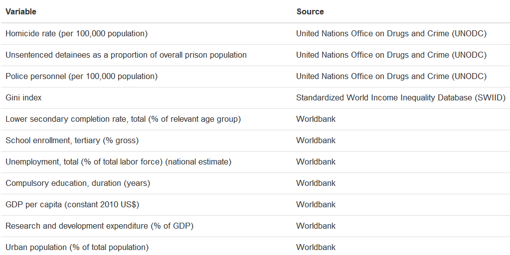
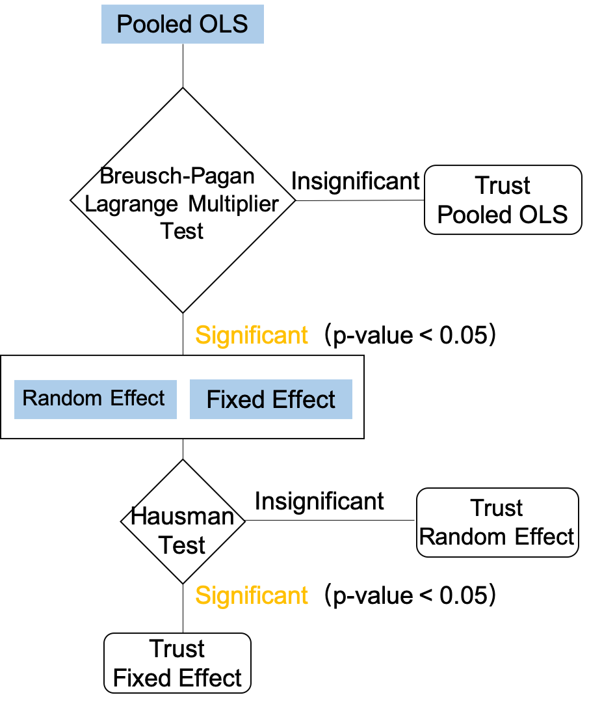

<style>
.column-left{
  float: left;
  width: 35%;
  text-align: left;
}
.column-right{
  float: right;
  width: 65%;
  text-align: left;
}
.reduced{
  font-size: 16px;
}
.small_font14{
  font-size: 14px;
}
.small_font18{
  font-size: 18px;
}
</style>


```{r setup, include=FALSE}
knitr::opts_chunk$set(echo = TRUE, warning = F, message = F)
library(knitr)
library(kableExtra)
library(bestNormalize)
library(dplyr)
library(GGally)
library(ggplot2)
library(gplots)
library(lmtest)
library(plm)
```

```{r, echo=F}
data <- read.csv("Data/data_no_missings.csv", header = T)

data$X <- NULL

# Shortening names of the columns
colnames(data) <- c("Country", "Year", "Homicide", "Inequality", "Education_years", "GDP_per_capita",
                    "Lower_secondary_completion_rate", "RnD_expenditure", "School_enrollment", 
                    "Unemployment", "Urbanization_rate","Unsentenced", "Police")

df <- data %>%
  select(Country, Year, Homicide, Inequality, Education_years, 
         GDP_per_capita, Lower_secondary_completion_rate, 
         School_enrollment, Unemployment, Unsentenced, Police) %>%
  filter(Year %in% 2003:2015)

# Data transformation
df$ln_Homicide <- log(df$Homicide)
df$ln_GDP_per_capita <- log(df$GDP_per_capita)
df$Unemployment_int <- cut(df$Unemployment,
                           breaks = c(0,5.5,8.5,Inf),
                           labels = c("_low", "_medium","_high"))

df2 <- data %>%
  select(Country, Year, Homicide, Inequality, Education_years, 
         GDP_per_capita, Lower_secondary_completion_rate, 
         School_enrollment, Unemployment, Unsentenced, Police)

df2$ln_Homicide <- log(df2$Homicide)
df2$ln_GDP_per_capita <- log(df2$GDP_per_capita)
df2$Unemployment_int <- cut(df2$Unemployment,
                           breaks = c(0,5.5,8.5,Inf),
                           labels = c("_low", "_medium","_high"))

df3 <- data %>%
  select(Country, Year, Homicide, Inequality, Education_years, 
         GDP_per_capita, Lower_secondary_completion_rate, 
         School_enrollment, Unemployment, Unsentenced, Police,
         Urbanization_rate, RnD_expenditure)

df3$ln_Homicide <- log(df3$Homicide)
df3$ln_GDP_per_capita <- log(df3$GDP_per_capita)
df3$Unemployment_int <- cut(df3$Unemployment,
                            breaks = c(0,5.5,8.5,Inf),
                            labels = c("_low", "_medium","_high"))
df3$ln_RnD_expenditure <- log(df3$RnD_expenditure)
```

```{r, echo=F}

source("functions/model_select.R")

model_diagnostic <- function(model, data = data, sig.level = 0.05) {
  
  library(dplyr)
  library(lmtest)
  library(plm)
  
  
  # Breusch-Pagan LM test for cross-sectional dependence
  cross_sectional_BP <- pcdtest(model, test = c("lm"))
  
  cross_sectional_BP_con <- ifelse(cross_sectional_BP$p.value < sig.level, "cross-sectional dependence", "no cross-sectional dependence")
  
  # Pesaran CD test for cross-sectional dependence
  cross_sectional_P <- pcdtest(model, test = c("cd"))
  
  cross_sectional_P_con <- ifelse(cross_sectional_P$p.value < sig.level, "cross-sectional dependence", "no cross-sectional dependence")
  
  # Breusch-Godfrey/Wooldridge test for serial correlation
  serial_correlation <- pbgtest(model)
  
  serial_correlation_con <- ifelse(serial_correlation$p.value < sig.level, "serial correlation", "no serial correlation")
  
  # Breusch-Pagan test for heteroskedasticity
  heteroskedasticity <- bptest(model$formula,
                               data = data,
                               studentize=F)
  
  heteroskedasticity_con <- ifelse(heteroskedasticity$p.value < sig.level, "heteroskedasticity", "homoskedasticity")
  
  
  # Data frame result
  result <- data.frame(
    test = c("Breusch-Pagan LM test for cross-sectional dependence",
             "Pesaran CD test for cross-sectional dependence",
             "Breusch-Godfrey/Wooldridge test for serial correlation",
             "Breusch-Pagan test for heteroskedasticity"
             ),
    p.value = c(cross_sectional_BP$p.value, cross_sectional_P$p.value, 
                serial_correlation$p.value, heteroskedasticity$p.value) %>% 
      round(4),
    conclusion = c(cross_sectional_BP_con, cross_sectional_P_con,
                   serial_correlation_con, heteroskedasticity_con),
    row.names = NULL
    )
  
  result$p.value <- ifelse(result$p.value == 0, "< 0.0001" , result$p.value)
  
  
  return(result)

}

```


## The aim of the project

* **Reproduce** and **replicate** the results of a bachelor thesis study prepared in 2019 by Joanna Ceglińska (one of the project's authors).

$$ $$

More precisely:

* we decided to check whether, based on the same initial data, we will obtain the same results,

* and whether the results are **robust** to changes in the initial assumptions and to expanding the dataset.

## Main modifications {.build}

* Different software (R and Python instead of STATA)

* New method of missing data imputation

* Extension of the dataset with new observations (from 2 consecutive years)

* Extension of the dataset with two new variables

* Implementing more advanced methods of data analysis and visualization


## Analyzing the problem

The main concern - poor economic situation in countries in Latin America. 

Venezuela: an economic power after WWII, now it struggles with murders, kidnapping, drug dealing and other crimes.

Aren't countries like the United States, Germany or Switzerland in danger of a similar situation?

```{r , echo=FALSE, out.width = '55%', fig.align='center'}
plotmeans(Homicide ~ Year, main="Heterogeineity across years", data=data)
```

## The dependent variable

* The dependent variable is the **homicide rate**, which is the number of homicides (deaths caused by another person's violence) per 100,000 population.

* A homicide is **not** equivalent to murder!

* Why this variable?

  - serious crime
  
  - available data
  
  - well tracked
  
  - reliable information
  
  - universal definition across cultures and countries


## Homicide rate distribution

```{r, echo=F, fig.align='center'}
ggplot(data) +
  geom_histogram(aes(Homicide), fill = "Steelblue", color = "black")
```

## Data

<!-- **Common characteristics:** -->

* Homicide rate as the dependent variable

* 48 countries

$$ $$
<!-- **Differences:** -->

<div class="column-left">
 **Original dataset**

* Years 2003-2015
* 8 independent variables
* 624 observations in total

</div>
<div class="column-right">
**Extended dataset**

* Years 2003-2017 
* 8 + 2 independent variables:
  - Research and development expenditure 
  - Urbanization rate
* 720 observations in total

</div>


## Independent variables 
<div class="small_font18">

* Unsentenced detainees as a proportion of overall prison population

* Police personnel (per 100,000 population)

* Gini index (income inequality measure)

* Lower secondary completion rate (% of relevant age group)

* School enrollment,  tertiary (% gross)

* Unemployment (% of total labor force) (national estimate)

* Compulsory education duration (years)

* GDP per capita (constant 2010 US$)

* **Research and development expenditure (% of GDP)**

* **Urban population (% of total population)**
</div>

## Data sources

```{r , echo=FALSE, out.width = '80%', fig.align='center'}

```

<div class="small_font14">

Additional sources:

* Research and development expenditure variable (Dominican Republic, 2013):
Guzmán J. & Encarnación C., "Measuring and Promoting (R&D) Expenditure in Manufacturing Companies of High-Tech Healthcare Products in the Dominican Republic" (2015). Rochester Institute of Technology

* Tertiary school enrollment (Turkey, 2004-2015) : www.knoema.com

</div>

## Filling the missings value

**Previously:** manual way, prone to mistakes and errors in estimations - relying on trends in data

**Now:** moving average algorithm (2 period window) that fills in the blanks automatically based on existing values of observations

Advantages:

* consistent results
* fast, reusable algorithm
* unbiased when it comes to estimation


## Research hypotheses

<div class="small_font18">
<span style="color:green">
**Positive impact (increase the crime level):** </span>

* Unsentenced detainees as a proportion of overall prison population

* Unemployment rate

* Urban population 


<span style="color:red">
**Negative impact (decrease the crime level)**</span>

* Income inequality (Gini index)

* GDP per capita

* Years of compulsory education

* Lower secondary education completion rate

* Tertiary school enrollment

* Police personnel

* Research and development expenditure

</div>

# Reproduction

## The schema of model selection

```{r , echo=FALSE, out.width = '45%', fig.align='center'}

```

## Reproduction - model selection

```{r, echo=F}
# fixed effects model
fixed <- plm(ln_Homicide ~ Inequality + Education_years + ln_GDP_per_capita +
             Lower_secondary_completion_rate + School_enrollment + 
             Unemployment_int + Unsentenced + Police,
             data = df, 
             index=c("Country", "Year"),
             model="within")

# random effects model
random <- plm(ln_Homicide ~ Inequality + Education_years + ln_GDP_per_capita +
               Lower_secondary_completion_rate + School_enrollment + 
               Unemployment_int + Unsentenced + Police,
             data = df, 
             index=c("Country", "Year"),
             model="random")

# POLS
pols <- plm(ln_Homicide ~ Inequality + Education_years + ln_GDP_per_capita +
              Lower_secondary_completion_rate + School_enrollment + 
              Unemployment_int + Unsentenced + Police,
            data = df,
            index=c("Country", "Year"),
            model="pooling")

model_select(fixed,random, pols) %>% 
           kbl(booktabs = T) %>%
           kable_material_dark(full_width = F, bootstrap_options = c("hover"), font_size = 22)
```

$$ $$
$$ \Rightarrow \text{we choose} \mathbf{\text{ fixed effects model}} $$

## Fixed effects model {.smaller}

```{r, echo=F}
a <- summary(fixed)
a$formula
coeftest(fixed)
```

```{r, echo=F}
# Lower_secondary_completion_rate
model1.1 <- plm(ln_Homicide ~ Inequality + Education_years + ln_GDP_per_capita +
                School_enrollment + Unemployment_int + Unsentenced + Police,
                data = df, 
                index=c("Country", "Year"),
                model="within")

## Police
model1.2 <- plm(ln_Homicide ~ Inequality + Education_years + ln_GDP_per_capita +
                 School_enrollment + Unemployment_int + Unsentenced,
                data = df, 
                index=c("Country", "Year"),
                model="within")

## Inequality
model1.3 <- plm(ln_Homicide ~ Education_years + ln_GDP_per_capita +
                  School_enrollment + Unemployment_int + Unsentenced,
                data = df, 
                index=c("Country", "Year"),
                model="within")
```

## General-to-specific procedure {.smaller}

```{r, echo=F}
coeftest(fixed)
```

## General-to-specific procedure {.smaller}

```{r, echo=F}
coeftest(model1.1)
```

* <del> Lower_secondary_completion_rate

## General-to-specific procedure {.smaller}

```{r, echo=F}
coeftest(model1.2)
```

* <del> Lower_secondary_completion_rate
* <del> Police

## General-to-specific procedure {.smaller}

```{r, echo=F}
coeftest(model1.3)
```

* <del> Lower_secondary_completion_rate
* <del> Police
* <del> Inequality

## Model diagnostic

```{r}
model_diagnostic(model1.3, data = df) %>% 
  kbl(booktabs = T) %>%
  kable_material_dark(full_width = F, bootstrap_options = c("hover"), font_size = 22)
```

$$ $$
$$ \Rightarrow \text{appropriate robust estimator needed} $$

## Robust estimator

```{r}
coeftest(model1.3, 
         vcovHC(model1.3, method = "arellano", type="HC0", cluster = "time"))
```

## Bachelor thesis model

```{r}
model_Bachelor <- plm(ln_Homicide ~ Inequality + ln_GDP_per_capita + 
                        School_enrollment + Police + Unsentenced,
                      data = df, 
                      index = c("Country", "Year"),
                      model = "within")
```

```{r, echo=F}
model_diagnostic(model_Bachelor, data = df) %>% 
  kbl(booktabs = T) %>%
  kable_material_dark(full_width = F, bootstrap_options = c("hover"), font_size = 22)
```

## {.smaller}

<center>
```{r, echo=F}
library(stargazer)

model1.final <- coeftest(model1.3, vcovHC(model1.3, method = "arellano", type="HC0", cluster = "time"))

model_Bachelor.final <- coeftest(model_Bachelor, vcovHC(model_Bachelor, method = "arellano", type="HC0", cluster = "time"))

stargazer(model_Bachelor.final, model1.final, type="text", colnames = TRUE, column.labels = c("Bachelor","Reproduction"), no.space = T)

```
</center>

# Replication | <br> + 2 years / 96 observations

## Model selection

```{r, echo=F}
# fixed effects model
fixed2 <- plm(ln_Homicide ~ Inequality + Education_years + ln_GDP_per_capita +
                Lower_secondary_completion_rate + School_enrollment + 
                Unemployment_int + Unsentenced + Police,
              data = df2, 
              index=c("Country", "Year"),
              model="within")

# random effects model
random2 <- plm(ln_Homicide ~ Inequality + Education_years + ln_GDP_per_capita +
                 Lower_secondary_completion_rate + School_enrollment + 
                 Unemployment_int + Unsentenced + Police,
               data = df2, 
               index=c("Country", "Year"),
               model="random")

# POLS
pols2 <- plm(ln_Homicide ~ Inequality + Education_years + ln_GDP_per_capita +
               Lower_secondary_completion_rate + School_enrollment + 
               Unemployment_int + Unsentenced + Police,
             data = df2,
             index=c("Country", "Year"),
             model="pooling")

model_select(fixed2, random2, pols2) %>% 
           kbl(booktabs = T) %>%
           kable_material_dark(full_width = F, bootstrap_options = c("hover"), font_size = 22)
```

$$ $$
$$ \Rightarrow \text{we choose} \mathbf{\text{ fixed effects model}} $$

## Fixed effects model {.smaller}

```{r, echo=F}
a <- summary(fixed2)
a$formula
coeftest(fixed2)
```

```{r, echo=F}
model2.3 <- plm(ln_Homicide ~ Education_years + ln_GDP_per_capita +
                  School_enrollment + Unemployment_int + Unsentenced,
                data = df2, 
                index=c("Country", "Year"),
                model="within")
```

## General-to-specific procedure {.smaller}

```{r, echo=F}
coeftest(model2.3)
```

* <del> Lower_secondary_completion_rate
* <del> Police
* <del> Inequality

## Model diagnostic

```{r}
model_diagnostic(model2.3, data = df2) %>% 
  kbl(booktabs = T) %>%
  kable_material_dark(full_width = F, bootstrap_options = c("hover"), font_size = 22)
```

$$ $$
$$ \Rightarrow \text{appropriate robust estimator needed} $$

## {.smaller}

<center>
```{r, echo=F}
model2.final <- coeftest(model2.3, vcovHC(model2.3, method = "arellano", type="HC0", cluster = "time"))

stargazer(model2.3, model2.final, type="text", colnames = TRUE, column.labels = c("","with robust estimator"), no.space = T)

```
</center>


# Replication | <br> + 2 years / 96 observations <br> + 2 independent variables

## Model selection

```{r, echo=F}
# fixed effects model
fixed3 <- plm(ln_Homicide ~ Inequality + Education_years + ln_GDP_per_capita +
                Lower_secondary_completion_rate + School_enrollment + 
                Unemployment_int + Unsentenced + Police + Urbanization_rate + ln_RnD_expenditure,
              data = df3, 
              index=c("Country", "Year"),
              model="within")

# random effects model
random3 <- plm(ln_Homicide ~ Inequality + Education_years + ln_GDP_per_capita +
                 Lower_secondary_completion_rate + School_enrollment + 
                 Unemployment_int + Unsentenced + Police + Urbanization_rate + ln_RnD_expenditure,
               data = df3, 
               index=c("Country", "Year"),
               model="random")

# POLS
pols3 <- plm(ln_Homicide ~ Inequality + Education_years + ln_GDP_per_capita +
               Lower_secondary_completion_rate + School_enrollment + 
               Unemployment_int + Unsentenced + Police + Urbanization_rate + ln_RnD_expenditure,
             data = df3,
             index=c("Country", "Year"),
             model="pooling")

model_select(fixed3, random3, pols3) %>% 
           kbl(booktabs = T) %>%
           kable_material_dark(full_width = F, bootstrap_options = c("hover"), font_size = 22)
```

$$ $$
$$ \Rightarrow \text{we choose} \mathbf{\text{ fixed effects model}} $$

## Fixed effects model {.smaller}

```{r, echo=F}
a <- summary(fixed3)
a$formula
coeftest(fixed3)
```

```{r, echo=F}
model3.4 <- plm(ln_Homicide ~ Education_years + ln_GDP_per_capita +
                  School_enrollment + Unemployment_int + Unsentenced + Urbanization_rate,
                data = df3, 
                index=c("Country", "Year"),
                model="within")
```

## General-to-specific procedure {.smaller}

```{r, echo=F}
coeftest(model3.4)
```

* <del> Lower_secondary_completion_rate
* <del> Police
* <del> Inequality
* <del> ln_RnD_expenditure

## Model diagnostic

```{r}
model_diagnostic(model3.4, data = df3) %>% 
  kbl(booktabs = T) %>%
  kable_material_dark(full_width = F, bootstrap_options = c("hover"), font_size = 22)
```

$$ $$
$$ \Rightarrow \text{appropriate robust estimator needed} $$

## {.smaller}

<center>
```{r, echo=F}
model3.final <- coeftest(model3.4, vcovHC(model3.4, method = "arellano", type="HC0", cluster = "time"))

stargazer(model3.4, model3.final, type="text", colnames = TRUE, column.labels = c("","with robust estimator"), no.space = T)

```
</center>

# Conclusion

## {.smaller}

<center>
```{r, echo=F}
stargazer(model_Bachelor.final, model1.final, model2.final, model3.final, 
          type="text", colnames = TRUE, 
          column.labels = c("Bachelor","Reproduction","Replication 1", "Replication 2"), no.space = T)

```
</center>

## Verification of hypotheses

```{r, echo=F}
hyp <- data.frame(H = c("Income inequality", "GDP per capita", "The level of education (basic)", "The level of education (tertiary)", 
                        "The ease of detecting a crime", "Poor labor market conditions",
                        "The effectiveness of the justice system"),
                  Bachelor_thesis = c("\\+","\\+","–","\\+","\\+","–","\\+"),
                  Reproduction = c("–","\\+","\\+","\\+","–","\\+","\\+"),
                  Replication_1 = c("–","\\+","\\+","\\+","–","\\+","\\+"),
                  Replication_2 = c("–","\\+","\\+","\\+","–","\\+","\\+")
                  )

colnames(hyp)[1] <- "Hypothesis connected with"

hyp %>% 
  kbl(booktabs = T) %>%
  kable_material_dark(full_width = F, bootstrap_options = c("hover"), font_size = 20)
```


## Conclusions

* Reproduction and replications gave very similar results to each other.

* Some of the hypotheses in the Bachelor thesis were not verified by our reproducible research.

* Adding Urbanization_rate improved the model and **did** change values of some estimators, but not the general conclusion.

* The project emphasizes the importance of correct data preparation (filling missing values).

# Thank you for your attention! 

